# Lab+ for GitLab

Lab+ is your ultimate GitLab mobile app that lets you interact with your projects like as if you
were using desktop.

Lab+ lets you see the latest happenings wherever you are, reply to issues so they can be taken care
of faster, manage and organise projects with labels, browse your files, code and more !

Lab+ lets you:

- Browse your latest notifications
- Read, react, and reply to Issues and Pull Requests
- Organise Issues with labels, assignees, projects, and more
- Browse your files and code
- Adding multiple accounts
- View Pipeline Status

Or download the latest APK from
the [Releases Section](https://github.com/thelooter/labplus_for_gitlab/releases/latest).

## Quick start

1. Install flutter https://docs.flutter.dev/get-started/install
2. Install FVM https://fvm.app/docs/getting_started/overview
3. In the app root directory run following command `fvm use 3.19.6`

## Screenshots

<table>
  <tr>
    <th>Authentication</th>
  </tr>
  <tr>
    <th>Light Mode</th>
  </tr>
  <tr>
    <td>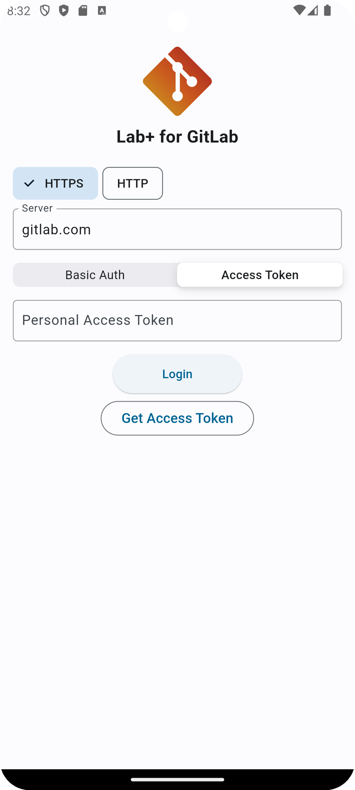</td>
  </tr>
 </table>

<table>
  <tr>
    <th colspan="2">Projects</th>
  </tr>
  <tr>
    <th>Light Mode</th>
    <th>Dark Mode</th>
  </tr>
  <tr>
    <td>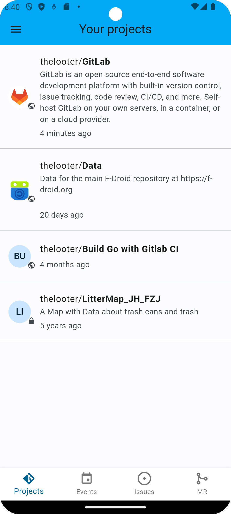</td>
    <td>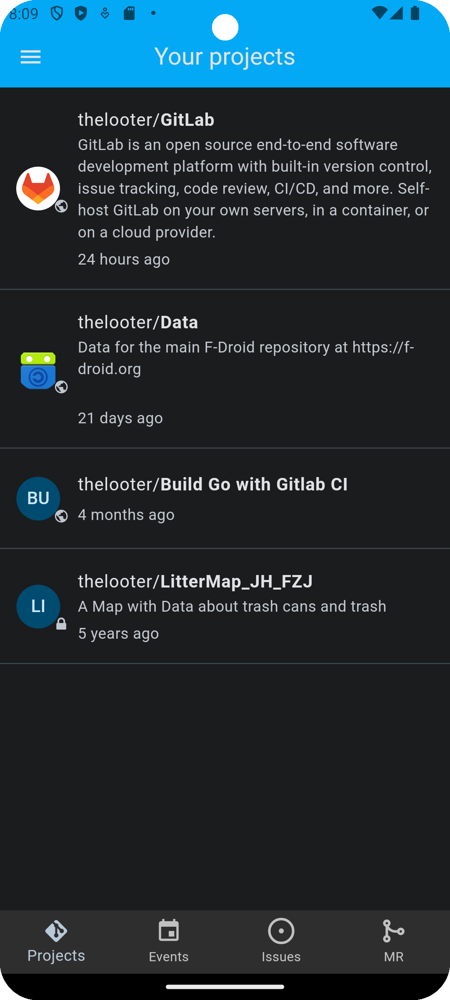</td>
  </tr>
 </table>

<table>
  <tr>
    <th colspan="2">Project</th>
  </tr>
  <tr>
    <th>Light Mode</th>
    <th>Dark Mode</th>
  </tr>
  <tr>
    <td>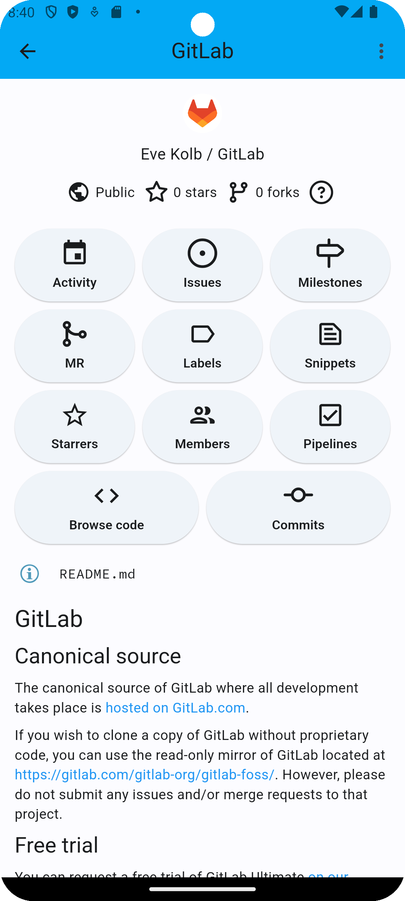</td>
    <td>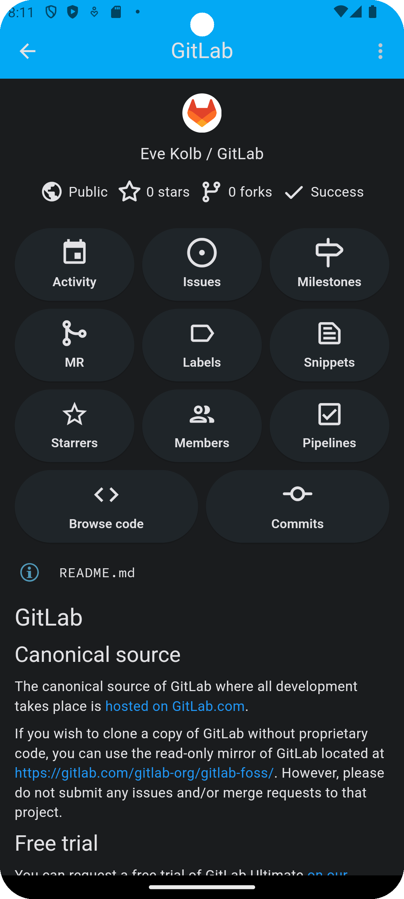</td>
  </tr>
 </table>

<table>
  <tr>
    <th colspan="2">Activity</th>
  </tr>
  <tr>
    <th>Light Mode</th>
    <th>Dark Mode</th>
  </tr>
  <tr>
    <td>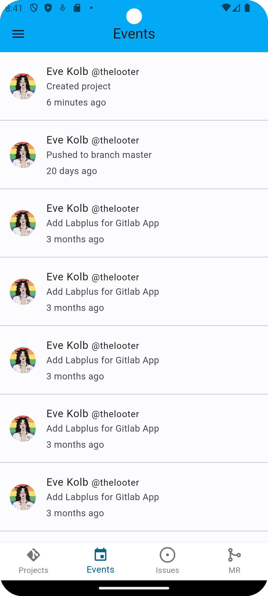</td>
    <td>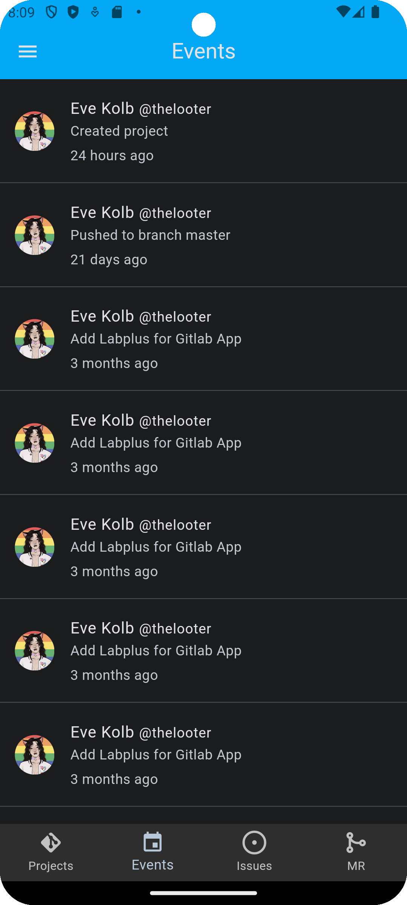</td>
  </tr>
 </table>

<table>
  <tr>
    <th colspan="2">Merge Requests</th>
  </tr>
  <tr>
    <th>Light Mode</th>
    <th>Dark Mode</th>
  </tr>
  <tr>
    <td>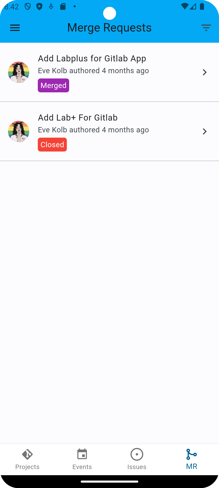</td>
    <td>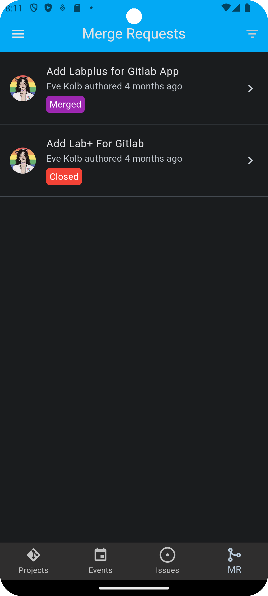</td>
  </tr>
 </table>

<table>
  <tr>
    <th colspan="2">Merge Request</th>
  </tr>
  <tr>
    <th>Light Mode</th>
    <th>Dark Mode</th>
  </tr>
  <tr>
    <td>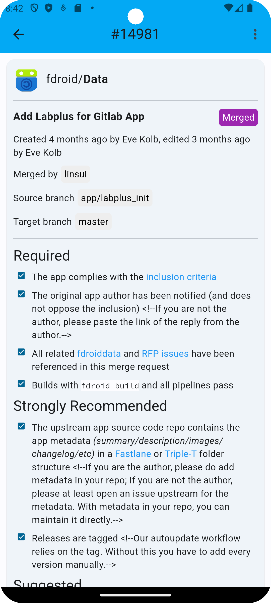</td>
    <td>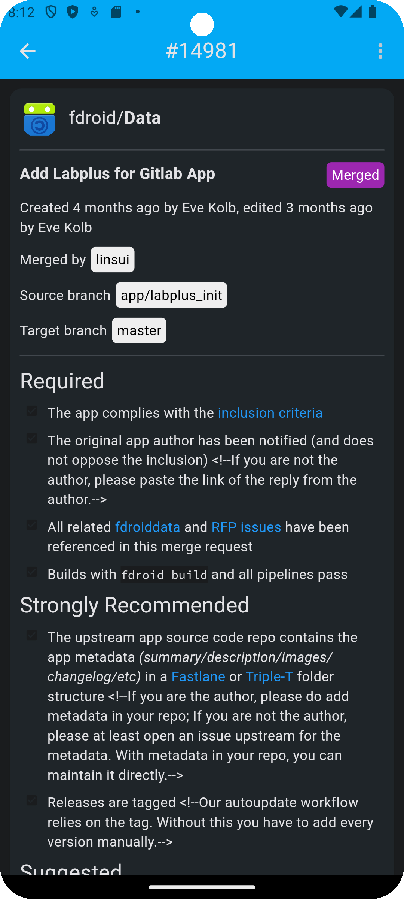</td>
  </tr>
 </table>

<table>
  <tr>
    <th colspan="2">Merge Request (Continued)</th>
  </tr>
  <tr>
    <th>Light Mode</th>
    <th>Dark Mode</th>
  </tr>
  <tr>
    <td>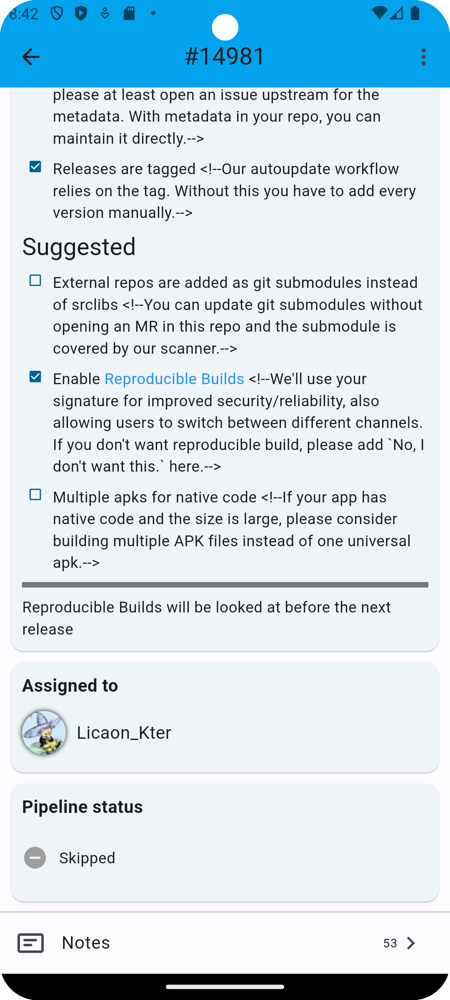</td>
    <td>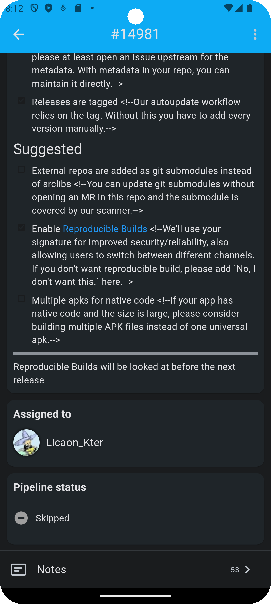</td>
  </tr>
 </table>

<table>
  <tr>
    <th colspan="2">Merge Request Notes</th>
  </tr>
  <tr>
    <th>Light Mode</th>
    <th>Dark Mode</th>
  </tr>
  <tr>
    <td>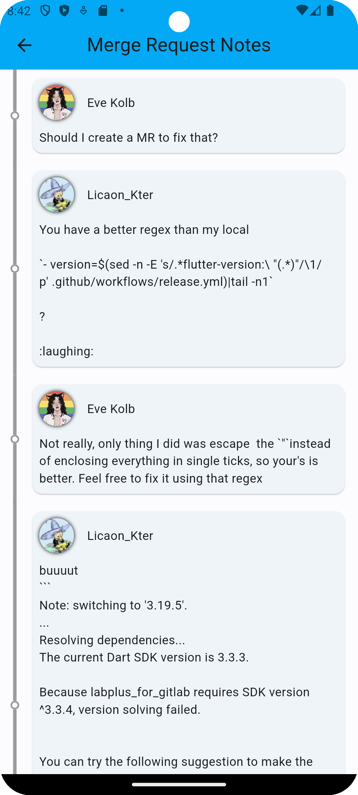</td>
    <td>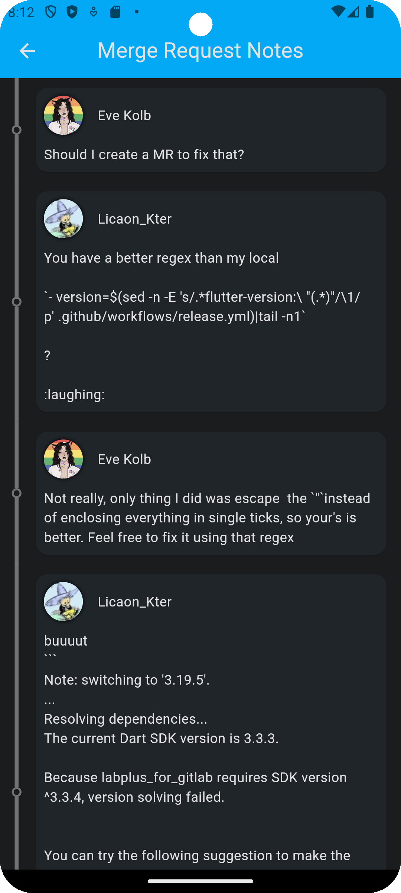</td>
  </tr>
 </table>